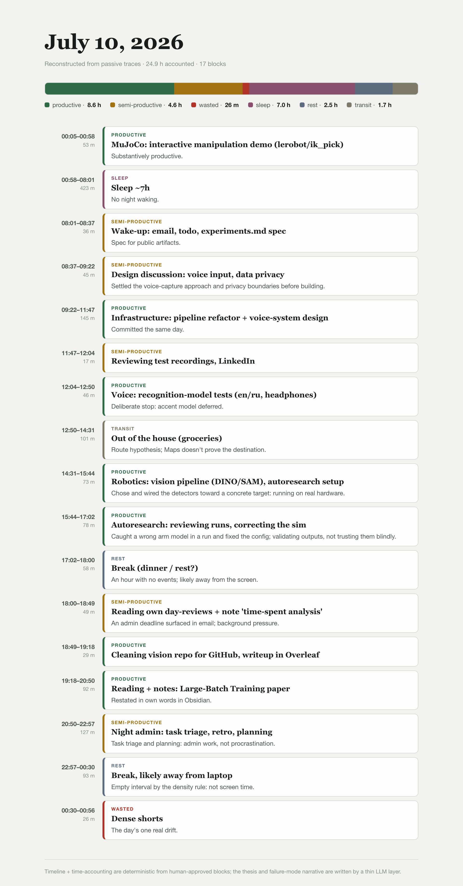

# Personalized Activity Reconstruction

*Self-improving personalized productivity system: it reconstructs your day from
passive traces and sharpens with your feedback.*

> **Update, July 2026.** This repository is the original prototype of **Hindsight**,
> built at the *Self-Improving Agents* hackathon hosted by AGI House. The project has
> since moved to a **private repository** and been rebuilt from scratch as a system I
> use **every day**, now in private beta at
> **[hindsight.it.com](https://hindsight.it.com)**. This tree is kept as a public
> snapshot of the early open version; the sections below describe where the project
> actually is now.

**A passive lifelog that reconstructs your day from the traces you already leave,
and surfaces not just where the time went, but the constraint behind it.**

No manual logging. It reads the faint signals a normal day already produces
(active-window focus, browser titles, movement, tool/coding sessions), segments
them into blocks, and writes an honest daily *reconstruction*: what you were
doing, why, and what it cost, with the raw streams derived-then-deleted so the
sensitive data never leaves the machine.

**Example of system output** (one reconstructed day):



*<sub>A reconstructed day: the time-accounting bar and verdict-coloured timeline are
deterministic; the thesis and failure-mode narrative are written by a thin LLM layer
on top. (Original in Russian: [`assets/day-reconstruction-ru.png`](assets/day-reconstruction-ru.png).)</sub>*

---

## The problem

Ordinary productivity tools log **where** attention went ("3 h in a browser,
40 min in Maps"), but never **what it meant**. The same browser session can be
focused work, job-search, research, doom-scrolling, or feeling unwell. That
missing layer of *interpretation* is exactly what makes a time log worth reading,
and it is the layer generic trackers throw away.

And even when the meaning is recovered, insight alone rarely changes behavior.
People already know their failure modes and repeat them. Behavior sits on a
**dependency graph**: it changes when you find the *binding* constraint, not when
a dashboard restates the pattern. So the goal is not prettier charts. It is to
reconstruct the day accurately *and* point at what is actually in the way.

## Where it is now

A working, daily-use system (private repo). Current capabilities:

- **Passive capture.** Active-window focus, browser titles, coding/agent sessions;
  to-do and calendar items, movement, and voice as optional local sources.
- **Deterministic evidence pipeline.** Typing-gap segmentation turns raw streams
  into compact, human-readable *evidence blocks*. The LLM never touches raw
  keystrokes.
- **Personalized heuristics.** A growing library of user-specific rules (currently
  ~20: FOMO, building without a spec, sleep-shift, environment-triggered
  perfectionism, health-limited blocks, and more) *extracted from the user's
  feedback on past automatic breakdowns*. The library grows and sharpens with more
  usage and feedback. Some rules first appear as an agent's hypothesis, then wait
  for user approval before entering the shared heuristics library.
- **Thin LLM write-up.** A small model turns the evidence and heuristic draft into
  a daily review: a time-accounting bar, a verdict-coloured timeline with quoted
  evidence, matched failure modes, and 3-5 questions only the user can answer.
- **Behavioural hypotheses.** From the extracted data the system helps formulate
  hypotheses and patterns about the user's behaviour, and suggests changes in a
  positive direction toward the user's stated goals.
- **Human-in-the-loop (optional).** The user can correct the occasional mistake;
  each correction improves the heuristics and future breakdowns. This is optional:
  the breakdown can also be generated fully autonomously, with no corrections
  required.
- **Automation.** A nightly job rebuilds the day and exports to calendar.

## How it works, at a glance

```
passive streams  ->  deterministic evidence blocks  ->  heuristic draft
     ->  thin LLM write-up  ->  human correction  ->  updated rules
```

The split is deliberate: everything factual (segmentation, time-accounting,
timeline) is deterministic and instant; only the interpretive prose is LLM-written,
and always marked verdict-vs-hypothesis.

Reconstruction quality is measurable, not vibes-based: the original prototype in
this repo scored its output against held-out ground-truth labels and tuned the
loop against that score. The current system keeps the same evaluate-and-correct
discipline.

## Privacy by architecture

- **Derive then delete.** Raw streams are reduced to compact evidence, then the
  raw keystroke/focus data is discarded. What the model reads is a sanctioned,
  sampled view: never the full keystream, never passwords.
- **Local-first.** The sensitive layer runs on the user's machine; only abstract,
  non-identifying patterns would ever be shared.

## Vision

The daily reconstruction is the wedge. The direction is a **personal aggregation
layer** that joins the domains people currently track in separate silos (time, then
money, then health) and reasons *across* them ("the spending cluster and the sleep
debt both track the same stressor"). Two beliefs drive it:

1. **Value on day one, not after a year.** A small set of well-established
   behavioral-science priors ships pre-installed, so the system is useful
   immediately instead of waiting to mine a year of your data.
2. **Surface the dependency, not the pattern.** The payoff is not "you wasted 2 h."
   It is finding the one binding constraint that, if changed, moves the rest.

The sharpest early fit is people with **high cross-domain complexity and high
stakes** (immigrants navigating visa, money, and career; founders; anyone in a
demanding transition), where a memory/aggregation prosthetic is a painkiller, not
a vitamin.

The fuller vision lives on the product landing page:
**[hindsight.it.com](https://hindsight.it.com)** (private beta).

## Running this snapshot

This archived prototype still runs on the SIA framework it was built on:

```
sia run --task productivity-breakdown --max_gen 3
```

See [`docs/walkthrough.md`](docs/walkthrough.md) and
[`docs/architecture.md`](docs/architecture.md) for details. Not maintained; the
current system is private.

## History

The prototype in this repo, **Hindsight**, was built at the *Self-Improving Agents*
hackathon hosted by AGI House, on the SIA self-improving-agent framework: a
three-role loop (a meta agent writes the interpreter, a target agent runs it, a
feedback agent rewrites it each generation) that reconstructed a day from public
evidence. See [`Hindsight.pptx`](Hindsight.pptx) for the original pitch. The current
system keeps the interpretation-improvement idea but drops the agent-rewriting
framework for a simpler, reliable pipeline.

## Status & license

Active development continues in a **private repository**; this snapshot is
**archived and not maintained**.

This tree is a derivative of the MIT-licensed [SIA framework](https://hexo.ai)
(© Hexo) and remains **MIT-licensed**; the original copyright notice is retained as
required. The privately-developed successor system is separate code and not covered
by this license.

*Interested in hiring, collaborating, or trying it? Reach out.*
